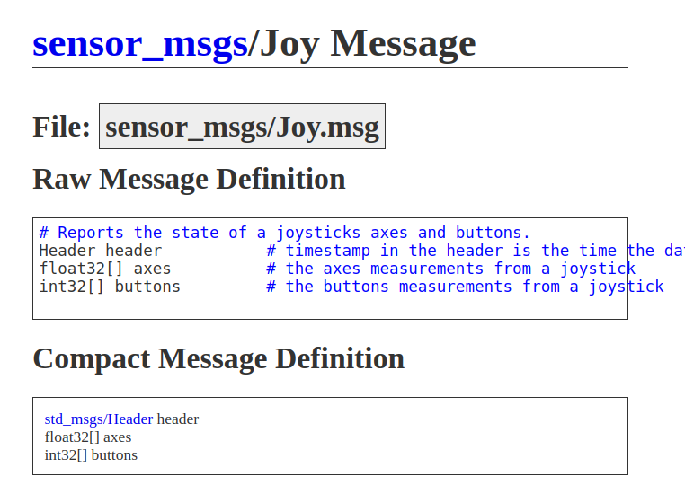

# Connecting-Joystick-To-Bot:

This tutorial will guide you to connect your joystick to your dev machine which will be inturn connected to your bot(robot).This way you would experience a slight more latency than directly connecting the joystick to the bot but this way is more beginner friendly, and will be used in the following tutorial.Regardless, you can follow along by changing a few commands and performing the coding part on the microcontroller connected to your bot. 

In this tutorial I will be using a Microsoft Xbox Controller with a dongle, and will be controlling the turtle bot (Turtlesim).Follow along!

# Pre-Requisites:

1.Joystick/Gamepad <br>
2.Basic knowledge of ROS2 Publisher-Subscriber concepts <.br>
3.Crearting a launch file(optional) <br>

# Installation Steps:

joystick – Provides the jstest and jscal utilities for testing and calibrating joystick devices. <br>
jtest-gtk – A GTK-based graphical joystick testing tool. <br>
evtest – A command-line utility for monitoring input device events, useful for debugging joystick inputs.<br>
Run the command:
```
sudo apt upgrade
sudo apt install joystick jstest-gtk evtest
```
The command adds tools to test and check joysticks on your Linux computer.

# Checking and controlling the JoyStick:

Run the command:
```
evtest
```
-Usually, the last number from the range given is the ID of the 
 controller.<br>
-Move the joystick/gamepad to confirm that it's detected and working.<br>
-If sucessful, you will see values updating in the terminal, indicating that Linux recognizes the device.<br>

# Visualize Joystick Input with jstest-gtk:

Run the command:
```
jstest-gtk
```
This will provide visual representation of the joystick's inputs.You can even play around with this and figure out what movements the buttons, thumb sticks, and triggers are responsible for.<br>
Note: This tool relies on an older driver underneath.<br>

# Running ROS-2 Joystick Nodes:

Run the command(Press tab twice after writing the command):
```
ros2 run joy
```

You should see:
```
game_controller_node
joy_node
joy_enumerate_devices
```

Run the command:
```
ros2 run joy joy_enumerate_devices
```
This will give a joystick ID, which is different from the evtest ID.The evtest ID comes from the Linux system and represents the joystick as a device under /dev/input/eventX, where X is assigned dynamically.The ROS2 joystick ID (joy_enumerate_devices) is assigned by ROS2 internally starting from 0 based on the detected order of joysticks.They may not match because Linux and ROS2 use different methods to number devices.

# Working of the sensor_msgs/msg/joy interface:




float32 axes[6]  -- The axes as mentioned in the table each control different motion. Each index is mapped to a particular movement. How intensely the motion occurs (i.e. not speed but complete left/right or complete up/down)depends on the analog input from the thumb controls and the LT and RT (trigger-buttons). Each element in the array can have value between -1.0 to 1.0 .
Eg : -1.0 could be complete left, 0.0 could be centre and 1.0 complete right.

int32 buttons[15] – the array elements are either 1 or 0 and store the state of the button. Each index of the array maps to buttons on the gamepad. ‘1’ is pressed and ‘0’ is not pressed.

Sizes of the arrays may change from controller to controller.

| Axis Index | Name              | Movement Description |
|------------|------------------|----------------------|
| 0          | Left Stick X (LEFTX) | Moves left (-1.0) to right (1.0). Movement |
| 1          | Left Stick Y (LEFTY) | Moves up (-1.0) to down (1.0) (Y-axis is usually inverted). Movement |
| 2          | Right Stick X (RIGHTX) | Moves left (-1.0) to right (1.0). Will rotate the bot anti-clockwise and clockwise respectively. |
| 3          | Right Stick Y (RIGHTY) | Moves up (-1.0) to down (1.0) (again, often inverted). Unless it is a drone, it will rotate the bot clockwise and anti-clockwise respectively. |
| 4          | Left Trigger (TRIGGERLEFT) | Gradually increases from 0.0 (not pressed) to 1.0 (fully pressed). |
| 5          | Right Trigger (TRIGGERRIGHT) | Gradually increases from 0.0 (not pressed) to 1.0 (fully pressed). |

Note: The indices and their associated controls may vary depending on your gamepad.

# Adding the pyhton file and configurations:

Copy the code from the python file in the repository and add your installation line in setup.py. 
Add the following dependencies in your package.xml:
```
<depend>rclpy</depend>
<depend>turtlesim_msgs</depend>
<depend>geometry_msgs</depend>
<depend>sensor_msgs</depend>
<depend>turtlesim</depend>
```
Note: If you are not connecting your joystick to the turtle bot, then the "turtlesim_msgs" and "turtlesim" won't be required.
Build the package using colcon in your workspace:
```
colcon build
```
Source your workspace:
```
source install/setup.bash
```
Open different terminals and run the following commands:
```
# Command 1
ros2 run joy joy_node
# Command 2
ros2 run turtlesim turtlesim_node
# Command 3
ros2 run ninja currentJoys
```
The last command will change depending on your executable name and package name.

If you wish to run all the three nodes using one command, create a launch folder in your package and copy the launch file from the repository in the folder.Make the following changes in your setup.py:
```
# Add at the beginning
import os
from glob import glob
# Add in the data files
 ('share/' + package_name, ['package.xml']),
        (os.path.join("share", package_name, "launch"), glob("launch/*.launch.py")),
```
To run the launch file:
```
ros2 launch <package_name> <launch_file_name>
```
# Reference Links:
https://creating-a-simple-launch-file.hashnode.dev/creating-launch-file
https://docs.ros.org/en/rolling/p/joy/
